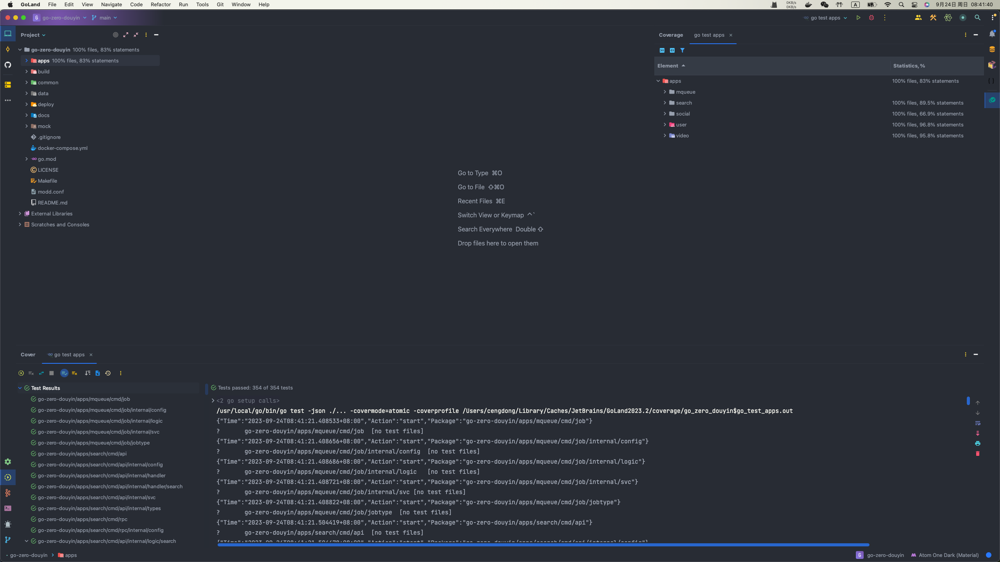

## go-zero-douyin

### 项目介绍
faker-douyin的go-zero版本，主要是想学习一下go-zero微服务框架。
之前gorm用的多一点，采用gorm作为持久层框架。
`feature/sqlx+sqlc`分支采用了sqlx+sqlc的方式，没有兜底缓存删除失败的情况(后续canal更新1.17之后会考虑)。
弃用了rabbitmq，因为电脑容器太多，而且日志系统已经有kafka，后续有消息队列需求再使用kafka。

### 项目目录介绍
- apps: 微服务集合(api+rpc)
- build: 自定义镜像
- common: 工具集合
- data: 项目运行数据(容器挂载点)
- deploy: 项目部署配置文件
- docs: 项目接口文档
- mock: 第三方库的mock(单元测试)

### 项目预计用到技术
- go-zero
- gorm/gen
- mysql
- redis
- asynq
- flink-cdc
- elasticsearch
- go-stash
- kafka
- filebeat
- jaeger
- prometheus
- grafana

### 项目功能点
还是faker-douyin的老功能，不过这次把视频数据上传到阿里云的oss服务，并且限制上传视频文件的大小。
项目日志的记录直接使用go-zero的logx，且集成了elk日志系统(filebeat->kafka->go-stash->es->kibana)。
~~go-zero绑定的消息代理是kafka，不太熟悉，先继续用rabbitmq，做完之后再替换为kafka。~~
放弃了用消息队列同步es数据的方式(耦合度高)，使用flink-cdc(flink sql)方案。
使用asynq作为分布式任务队列，实现视频的延迟发布（延迟任务）。

项目功能点：
- 用户
    - 注册
    - 登陆
    - 获取用户信息
    - 更新用户信息
- 视频
    - 获取视频流
    - 发布视频(延迟发布)
    - 查询用户视频列表
- 评论
    - 添加评论
    - 删除评论
- 点赞
    - 点赞视频
    - 取消点赞
    - 获取用户点赞视频列表
    - 获取视频点赞数
- 关注
    - 关注用户
    - 取消关注
    - 获取用户关注列表
    - 获取用户被关注数
- 搜索
    - 搜索用户
    - 搜索视频
    - 视频搜索自动补全

### 单元测试

### TodoList
- 基于gorse的推荐系统

